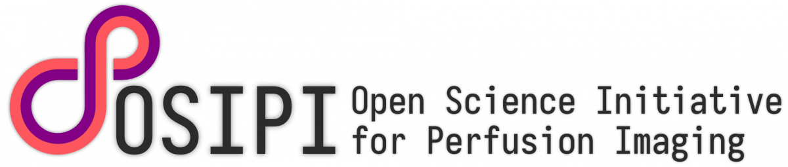

.. raw:: html

        

PyASL: Composite Python Library for ASL Image Processing
=========================================================

**PyASL** is an open-source Python library for processing arterial spin labeling (ASL) MRI data, developed under the `Google Summer of Code (GSoC) <https://summerofcode.withgoogle.com/>`_ program for the `ISMRM OSIPI Task Force 2.2 <https://osipi.ismrm.org/task-forces/task-force-2-2/>`_.

It integrates multiple community-validated ASL tools, originally in MATLAB, and supports both human and preclinical pipelines. PyASL includes modules for ASL-MRICloud, ASLtbx, DL-ASL, Oxford ASL, preclinical multi-TI PASL, and preclinical pCASL, harmonized with ASL-BIDS input format.

**Links**
---------

- 📦 PyPI: https://pypi.org/project/pyasl-osipi/
- 🧑‍💻 GitHub: https://github.com/OSIPI/TF2.2_OSIPI-ASL-toolbox/tree/main/PyASL

**Citation**
------------

This library is part of the ISMRM 2025 submission:  
*ISMRM Open Science Initiative for Perfusion Imaging (OSIPI): Composite Python Library for ASL Image Processing*

**License**
-----------

Licensed under the MIT License. See the `LICENSE <https://github.com/OSIPI/TF2.2_OSIPI-ASL-toolbox/blob/main/PyASL/LICENSE>`_ file for details.

.. toctree::
   :maxdepth: 2
   :caption: Contents

   installation
   usage
   json_parameters
   modules/index
